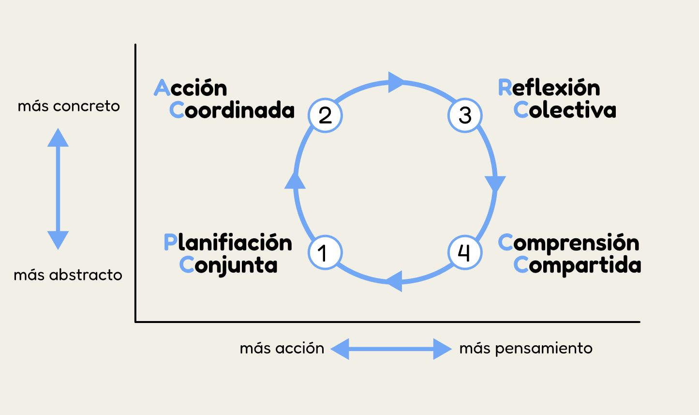

import { CardGrid, Card } from '@astrojs/starlight/components';

En el momento en que un joven o una joven asumen su compromiso ante la Ley Scout, la patrulla pasa a ser para ellos no sólo un grupo de amigos con quienes se disfruta, sino también una comunidad de aprendizaje que apoya en el desarrollo personal e invita a comprometerse con un proyecto común.

### Cambio en la conducta de "Todo" el joven y aprendizaje "Entre Todos" los jóvenes.

El aprendizaje que se logra en la patrulla está destinado a producir un cambio en la conducta, ya sea en términos de conocimientos (saber), de habilidades (saber hacer) o de actitudes (saber ser). No es sólo un incremento de los conocimientos -como ocurre básicamente en la sala de clases o en un grupo de estudio escolar- sino un crecimiento interior de la persona en todos los aspectos que forman su personalidad: cuerpo, inteligencia, voluntad, afectos, sociabilidad y espiritualidad. Es un aprendizaje de “todo” el joven.

Como las personas aprendemos de muy diversas formas, este crecimiento interior se da mediante un “continuo” que incluye escuchar, observar, preguntar, hacer cosas, investigar, reflexionar, autoevaluarse y ayudar a los demás a aprender. En consecuencia, el aprendizaje también es “entre todos”.

### En la patrulla se aprende a través de la acción

Es un aprendizaje esencialmente activo, en parte consciente y en parte inconsciente, que se produce fundamentalmente en tres planos:

- A través de la vida en común, compartiendo significados, aprendiendo a mirar e interpretar juntos las cosas que ocurren, trasmitiéndose sus sueños, encarnando los valores en la conducta y logrando el diseño y compromiso con un proyecto, que es en parte común y en parte individual. Este es el aspecto en que la patrulla cumple un papel de comunidad de vida fundada en el afecto común y dentro del marco valórico que ofrece la Ley Scout.
- Por medio de la planificación, ejecución y evaluación de las actividades. La patrulla opera aquí como una micro empresa, imaginando la actividad, diseñándola, adquiriendo las competencias y habilidades técnicas que permiten llevarla a cabo, generando y obteniendo los recursos, acompañando a sus miembros en la realización de la tarea, evaluando los resultados y representando fortalezas, debilidades y errores. En la patrulla los errores son parte del proceso de aprendizaje, ya que no se considera que éstos sean descréditos, sino oportunidades de ver lo que se habría podido hacer de modo distinto.
- Las actividades producen experiencias, cuya secuencia y acumulación paulatina permite que los jóvenes logren las conductas previstas en los objetivos educativos que el Movimiento les propone y que ellos han hecho suyos, modificándolos y complementándolos de acuerdo a sus intereses personales. Es la parte del aprendizaje en base a objetivos, en cuyo avance los jóvenes de la patrulla hacen las veces de tutores mutuos, que se asisten en su crecimiento personal, estimulan sus logros, refuerzan su autoimagen y se proponen

### El aprendizaje en la patrulla permite la respuesta en el momento preciso

En todos estos planos el aprendizaje al interior de la patrulla permite la respuesta en el momento preciso, lo que significa que en vez de acumular existencias de hechos y datos en las mentes de los jóvenes hasta que sea necesario su uso en un momento posterior, dichos datos se pueden utilizar sobre la base de su aplicación en el momento oportuno.

Los hechos e informaciones aprendidos se olvidan con facilidad si no encuentran eco en problemas reales. En cambio en la patrulla, el aprendizaje se produce porque el dato relativo a un tema específico se asimila en el momento en que se necesita. Si la primera vez que un joven debe preparar la comida en un campamento recibe la ayuda de otro más experimentado, bajo cuya mirada aprende a combinar los diferentes ingredientes, se habrán unificado enseñanza y aprendizaje en un mismo acto.

### En la patrulla se aprende "En Equipo" a través de la secuencia de actividades

Dijimos que el aprendizaje en la patrulla era en parte consciente y en parte inconsciente. Esto se logra porque el aprendizaje en equipo, especialmente con relación a las actividades, sigue un ciclo que se repite constantemente, y que va pasando sucesivamente de lo más concreto a lo más abstracto y de lo más activo a lo más reflexivo.

Por medio de la reflexión colectiva, los miembros de la patrulla se transforman en observadores de sus propios actos y pensamientos. Generalmente esta fase se inicia con la evaluación de una actividad: ¿cómo funcionó? ¿qué pensábamos y sentíamos cuando lo estábamos haciendo? ¿qué circunstancias nos afectaron? ¿qué falló? ¿vemos ahora las cosas de otra manera? ¿resultó mejor de lo pensado? ¿por qué? Es una fase muy rica en opiniones divergentes, donde destacarán los miembros de la patrulla que tienen capacidad para ver las cosas desde distintos ángulos, los que siempre tratan de “encontrarle cinco patas al gato”. Hay que estimular esta manera de pensar, que aunque a veces puede ser descabellada, es un paso necesario para la creatividad y la innovación.

De manera muy natural, casi imperceptible, la reflexión desemboca en una comprensión compartida de lo que pasó, buscando lazos y conexiones entre lo que se hizo y lo que se podría hacer. ¿Cuáles son los caminos que podríamos seguir en adelante? ¿qué hemos aprendido? ¿qué podríamos hacer a continuación? Es el momento de pensar ordenando las ideas, afinando la visión, encontrando alternativas posibles y descubriendo similitudes entre los hechos. Es el momento en que se destacan los “descubridores de conexiones”, los que tienen capacidad para encontrar motivos por los cuales las cosas ocurrieron de una determinada forma.

Luego viene la planificación conjunta, en que a partir de las posibilidades generadas en la etapa anterior se toman decisiones y se diseñan entre todos las cosas que se van a hacer en lo sucesivo. Esta etapa incluye generalmente cambios en la manera de actuar y en los roles de los integrantes. La decisión implica el aprendizaje de tomar opciones: “esto es lo que vamos a hacer y por estas razones”. Aquí aparecen los jóvenes con “pensamiento convergente”, buenos para idear soluciones, propensos a experimentar, que se impacientan por desplazarse rápido hacia un cierto punto que desemboque en la acción.

Por último se produce la acción coordinada, en que cada cual trabaja en diferentes tareas encaminadas a un mismo objetivo, respaldados por el análisis de todas las etapas precedentes. En esta fase se destacan “los prácticos”, especialistas en acomodar la teoría a la realidad; y si ven que la teoría no funciona, demuestran una capacidad natural para hacer ajustes sobre la marcha, lo que los hace esenciales.

Cuando se termina la actividad o la tarea, se regresa de inmediato a la etapa reflexiva: ¿cómo funcionó? Y el ciclo sigue su curso interminable.

No siempre se reúnen en una patrulla los distintos estilos o tipos de inteligencia que hemos descrito con ocasión de cada fase. Sin embargo, el uso constante de este ciclo de aprendizaje hará que afloren y se desarrollen todos los estilos que están potencialmente presentes en la patrulla. Si no aparecen todos, el Guía de Patrulla sabrá dónde están los puntos débiles y los responsables de la Unidad le ayudarán a compensar esa carencia. Si todos esos estilos se manifiestan, la patrulla tendrá resultados muy fructíferos, pero el clima interno será agitado y el Guía de Patrulla tendrá que aprender a orientar los debates en un grupo valioso pero difícil de gobernar.

Las etapas en que se comparte la comprensión de un problema y se planifica en conjunto, desarrollan en los jóvenes la capacidad de abstraer, uno de los prerrequisitos en la formación del conocimiento. Por su parte, la acción coordinada y la reflexión colectiva desarrollan la capacidad para ser concreto, un componente importante de la realización personal.

A su vez, planificación conjunta y acción coordinada están en el terreno del actuar, mientras reflexión colectiva y comprensión compartida se sitúan en el terreno del pensar. Esto permite que los jóvenes aprendan que todos los actos de su vida se moverán sobre la concurrida línea que va y vuelve constantemente del pensamiento a la acción, de la teoría a la práctica.

### Los jóvenes aprenden a aprender

Una de las ventajas de este aprendizaje cíclico es que los jóvenes lo practican casi sin darse cuenta. Si progresivamente los responsables de Unidad procuran que los Guías de Patrulla asuman que su principal papel es mantener la “rueda” del aprendizaje en movimiento, esta forma de actuar se convertirá en un modo de vida para los jóvenes, tal como el método científico es un modo de vida para quienes trabajan en laboratorios.

Al hacerse consciente este ciclo, los jóvenes no sólo aprenderán, sino que también aprenderán a aprender, lo que hoy se conoce como “potencial de aprendizaje” o “metaprendizaje” y que Baden-Powell denominaba “autoeducación”. En un sistema de formación centrado en los contenidos, en el mejor de los casos se aprende, pero se aprende de forma estática, con la ilusión de que se aprendió para siempre. En un sistema centrado en los procesos, se aprende de forma dinámica, porque se aprende a aprender.

En un mundo en cambio incesante, en el cual lo que más cambia es la velocidad del cambio, de poco sirve centrar el aprendizaje en los contenidos, ya que lo que hoy se aprende, mañana estará obsoleto. Si por el contrario, el aprendizaje enfatiza los procesos, se está aprendiendo a aprender, a desaprender y a reaprender, sabiendo encontrar, o generar los contenidos, en el momento en que se necesitan.

Eso es lo que pasa en la patrulla en términos de aprendizaje, o lo que “debiera pasar” si aplicamos apropiadamente el sistema de patrullas. Los procesos no se aprenden escuchando charlas ni haciendo pruebas. Se aprenden viviéndolos, por lo cual la patrulla, donde todo es vida, es un espacio privilegiado para aprender procesos.

Para que este aprendizaje ocurra y ocurra bien, necesitamos además crear un “campo de aprendizaje”.

### La aplicación del Método Scout crea en la patrulla un "Campo de Aprendizaje"

Un campo de aprendizaje es una estructura inmaterial pero real, que atraviesa una Unidad Scout en todos los sentidos, influyendo en la conducta de todos sus integrantes y facilitando el aprendizaje. Hoy sabemos que este tipo de campos existen -al igual que los campos gravitacional, electromagnético o cuántico- no porque los veamos directamente, sino porque experimentamos sus efectos. Cuando nos comunicamos por un teléfono celular estamos utilizando una red de ondas electromagnéticas que no vemos, pero que existen y atraviesan el espacio en distintas direcciones. Lo mismo ocurre con las ondas sonoras o con la fuerza de gravedad.

Los dirigentes scouts comprobamos en nuestros cursos la existencia de estos campos de aprendizaje. Preparamos en detalle la ambientación de la sala, la distribución de los espacios, las ayudas audiovisuales de las presentaciones, la forma de sostener los diálogos, la entrega de los materiales de apoyo. Luego los participantes aportan diálogos y establecen relaciones que nosotros jamás habríamos producido o siquiera imaginado. De pronto percibimos que todos estos factores han creado un “campo de aprendizaje” que en muchos aspectos nos hace innecesarios.

De igual manera, los espacios de nuestras patrullas y de nuestra Unidad Scout no están vacíos, sino que estructurados con un tejido invisible de actitudes y diálogos encadenados que crean un ambiente que conforma el comportamiento. Algunos de los factores que interactuando entre sí generan un campo de aprendizaje, son los siguientes:

- Interés manifiesto por el crecimiento personal de cada joven.
- Ambiente exento de crítica destructiva, castigos o medidas represivas.
- Incentivos a la participación, la creatividad y la innovación.
- Información fluida.
- Sensación de desafío.
- Reconocimiento oportuno de logros.
- Tolerancia a la espontaneidad.
- Propensión a escuchar.
- Ambiente de experimentación.
- Estimulación de las opiniones divergentes.
- Interacción continua.
- Disposición de los líderes a aprender.
- Paciencia con los ritmos individuales de aprendizaje.
- Conducción flexible.
- Escasa “reglamentación”.

Para crear un campo de aprendizaje no es necesario hablar de él ni dictar charlas que lo expliquen. Basta crear condiciones como las antes mencionadas y el campo de aprendizaje se instala sin mayor esfuerzo.

Todos los Guías de Patrulla que preparan con dedicación un campamento, que escogen el lugar apropiado, que distribuyen las tareas, que estimulan los esfuerzos individuales de los miembros de la patrulla, que organizan su rincón al aire libre, que realizan actividades atractivas, que logran que todos participen y opinen, que siguen con rigor un programa y que crean muchas otras condiciones de las antes mencionadas, observan de pronto que “las cosas están saliendo bien”, que los jóvenes parecen transformados y que los logros se empiezan a acumular unos detrás de otros. Sin que ellos lo adviertan y ni siquiera sepan que el ambiente surgido de esos esfuerzos tiene ese nombre, han logrado sin embargo instalar un campo de aprendizaje.

Una de las tareas principales de los líderes -especialmente Responsables de Unidad y Guías y Subguías de Patrulla- es la creación y mantención de campos de aprendizaje. Su existencia estimula a la patrulla como comunidad que aprende. Su ausencia deteriora el sistema de patrullas o lo convierte en una mera división administrativa de la Unidad.

### La patrulla impulsa a los jóvenes a integrarse en su comunidad cercana

A pretexto de que los jóvenes están “en período de formación”, muchas Unidades La patrulla impulsa a los jóvenes a integrarse en su comunidad cercana se cierran y cierran a sus patrullas sobre sí mismas, mirándose el ombligo. Sin dejar de mencionar que tal período no existe -toda nuestra vida es un largo período de formación donde nunca dejamos de aprender- afirmamos que el aprendizaje necesita proyectarse para ser efectivo.

El primer ámbito de proyección de una patrulla es su comunidad cercana, esto es, su Grupo Scout, la institución que lo patrocina, la escuela, sus compañeros, el vecindario, los padres y las familias de los jóvenes. Su apertura a esos ambientes implica aprendizaje, ya que su interacción con ellos hace las veces de “espejo” que les devela el avance en su crecimiento.

Además el ambiente cercano es una espléndida oportunidad de servir. Muchas son las organizaciones de la comunidad cercana a un Grupo Scout que no llegan a apreciar para qué sirve, o que consideran a los scouts óptimos ante sí mismos pero no muy útiles para los demás.

### La patrulla también se interesa en la comunidad lejana

La comunidad lejana empieza donde termina la comunidad cercana. Por comunidad lejana entendemos entonces la ciudad, la región, el país y el mundo. En el terreno propiamente scout es el distrito, la asociación, la Organización Mundial del Movimiento Scout.

En un mundo interconectado y globalizado, en que gran parte de lo que ocurre en lo local tiene sus orígenes en lo global, la patrulla no puede aprender en el aislamiento. Necesita saber cómo funciona el mundo, sus redes, sus influencias, sus problemas, sus actores. La lectura, el acceso a la información, el manejo útil de internet, la capacidad de desentrañar los supuestos y las causas que subyacen en las simples noticias, es un aprendizaje inevitable y necesario.

Las cosas funcionan en círculos. ¿Cómo vivir en un punto del círculo sin interesarse por averiguar cómo éste se conecta con los demás? Ese espíritu inquisitivo está latente en los jóvenes y se expresa en dinamismos que nuestro método utiliza. No olvidemos “el gusto por explorar” y el “afán de apropiarse de nuevos territorios”. Este interés en la comunidad lejana brotará con fuerza tan pronto como lo estimulemos.

### La patrulla puede ser mixta u homogénea en cuanto a sexo

La mixticidad de la patrulla en relación al sexo de sus integrantes es un asunto que genera controversias. Partidarios y detractores utilizan habitualmente variados argumentos, no siempre bien fundados ni desde la perspectiva en que debieran formularse, ya que el debate se presenta casi siempre contaminado con costumbres, tradiciones, temores, modas y conceptos culturales e ideológicos.

Para despejar el punto, proponemos razonar conforme a ciertas bases coherentes con la evolución psicológica de los jóvenes y con el sistema de patrullas propuesto por el método scout:

- La consideración de si una patrulla será o no mixta, debiera atender en primer lugar a la estructura natural del grupo informal de amigos. Si hemos insistido en que la patrulla operará como comunidad de aprendizaje en la medida en que se respete su carácter de grupo informal, aparece clara la primera regla que se debiera seguir: si el grupo informal que se constituye en patrulla scout es mixto en cuanto a sexo, la patrulla igualmente deberá serlo; y si es homogéneo, la patrulla también lo será. Siendo coherentes, no hay mucha discusión posible al respecto.
- Igual criterio debiera adoptarse respecto a la incorporación de nuevos miembros. Si la patrulla desea continuar siendo homogénea o mixta o desea cambiar este carácter, será su Consejo de Patrulla el que tendrá la primera palabra en ese sentido.
- Los dos criterios anteriores no afectan la herencia de una cultura particular ni las concepciones educativas de un determinado medio, ya que si de acuerdo a esa cultura y a esas concepciones los grupos informales de amigos no son mixtos, entonces las patrullas tampoco lo serán. La recomendación no consiste en actuar “contra cultura” sino a favor de prolongar en la patrulla la manera de ser del grupo informal.
- No obstante lo antes dicho, es bueno preguntarse ¿cuál es la tendencia natural de los jóvenes en esta edad? Entre 11 y 13 años, etapa más bien “biológica” de la adolescencia, en que los jóvenes se repliegan sobre sí mismos un poco asombrados ante sus cambios físicos, en todas las culturas se manifiesta una tendencia a conformar grupos homogéneos desde el punto de vista sexual. No significa que los jóvenes no tengan amigos o amigas del otro sexo, pero lo que un joven o una joven considera “su grupo” está reservado normalmente para los pares de su sexo.

A partir de los 13 o 14 años, dependiendo de las culturas o subculturas y de la realidad de cada joven en particular, con mayor o menor prontitud, los jóvenes vuelven a integrar en su grupo de amigos a jóvenes del sexo complementario, aunque de una manera diferente a como lo hacían en la infancia. Pasado el asombro ante las transformaciones físicas, superada la vergüenza, asumidos los cambios, comienza el interés por el otro sexo, casi siempre con emociones mezcladas y difusas, como es natural.

Como la Rama Scout comprende las edades que van de 11 a 15 años y hay buenas razones para mantener ese ciclo de desarrollo como primera etapa de la adolescencia, nuestros dilemas serán menores o mayores dependiendo si la patrulla es horizontal o vertical.

Si la patrulla de que se trate es más bien horizontal y está conformada mayoritariamente por jóvenes del primer rango de edad (11 a 13 años), es previsible que no se presenten dudas: la patrulla tenderá a ser homogénea. Si es horizontal y está integrada mayoritariamente por jóvenes del segundo rango de edad (13 a 15 años), es probable que exista interés de los jóvenes porque sea mixta. En ninguno de los dos casos hay problema, salvo las circunstancias particulares de aquellos jóvenes que dentro de la patrulla, en menor número, pertenecen al otro rango de edad, lo que deberá ser resuelto caso a caso, idealmente por la propia patrulla, que sabrá encontrar la mejor solución.

El dilema más severo surge en las patrullas verticales en las cuales se mezclan en proporciones similares jóvenes de uno y otro rango de edad, lo que significa que, una vez planteado el tema, es presumible que surgirán en su interior tendencias equivalentes a favor de la homogeneidad y de la mixticidad, o tal vez no, porque cada patrulla es una realidad diferente y responde también a la realidad del medio.

No se debe olvidar que a medida que los jóvenes crecen y se incorporan nuevos integrantes a la patrulla, ésta puede transformarse de horizontal en vertical o viceversa. Estas variaciones pueden tener a su vez influencia sobre la mixticidad de la patrulla, ya que según cómo se modifiquen los rangos de edad que se encuentran en su interior, puede también pasar de mixta a homogénea o viceversa. No hay nada en contra de que exista tal flexibilidad en la patrulla, criterio que responde al concepto scout de privilegiar ante todo su carácter de grupo informal.

### Criterios para adoptar una política sobre mixticidad de la patrulla

Luego de hacer los razonamientos anteriores y delimitar las áreas en que el dilema se presenta, recomendamos gobernar la situación de acuerdo a los siguientes criterios:

- Sugerir al Consejo de Unidad que mantenga una política flexible, abierta a todas las alternativas, evitando imponer “a priori” una determinada doctrina. Esto significa que en una Unidad pueden coexistir patrullas homogéneas femeninas, homogéneas masculinas y mixtas, dependiendo de la composición natural del grupo informal de amigos.

Como ya se señaló, esto implica también que una patrulla no es homogénea o mixta para siempre, ya que ello dependerá de su evolución, de las características de sus integrantes y de los cambios que se produzcan en su composición.

Por cierto que la existencia de patrullas mixtas exige en los dirigentes unas competencias diferentes a aquellas que serían necesarias si sólo existieran patrullas homogéneas. Desde luego, los estilos de animación varían, el equipo de dirigentes debe ser mixto y se recomienda que el acompañamiento de la progresión personal sea hecho por dirigentes del mismo sexo.

- Como esta política de apertura es parte de las normas de la Unidad, sería conveniente someterla a la aprobación de la Asamblea de Unidad. Como lo señaló Baden-Powell, “pregúntenle al joven”.

Más aún, la primera vez que la posibilidad de patrullas mixtas es planteada en una Unidad homogénea o en una Unidad mixta con patrullas homogéneas o en un ambiente no habituado a la mixticidad, es muy recomendable que el asunto sea analizado en conjunto con los distintos actores que intervienen en un Grupo Scout: los padres, la institución patrocinante y el Consejo de Grupo.

Un debate educativo previo y apropiado sobre este punto informará adecuadamente a los padres, permitirá una comprensión más amplia de las razones educativas, evitará malentendidos y, dependiendo de la realidad del ambiente y de la flexibilidad de los actores, se obtendrá que la decisión sea más compartida y posteriormente apoyada. En todo caso, y siempre que sea posible, la decisión debiera corresponder al Consejo de Unidad.

- Una vez consensuada una política flexible de acuerdo a los criterios anteriores, recomendamos que en los casos puntuales que se presenten en lo sucesivo, se sigan siempre los criterios enunciados al principio, esto es, respetar la composición natural que tenga o desee tener el grupo informal de amigos.
- Recomendamos procurar que la mixticidad u homogeneidad de una patrulla no rompa el dinamismo natural del pequeño grupo ni afecte su cohesión interna y, por consiguiente, su proceso de transformación en comunidad de aprendizaje. En los casos en que una patrulla no logre ponerse de acuerdo sobre este punto, y el debate amenace con romper su cohesión, se sugiere resolverlo mediante un diálogo de la patrulla con el Consejo de Unidad.
- Al tener patrullas mixtas o una Unidad mixta con patrullas homogéneas, recomendamos considerar con toda atención los requerimientos básicos establecidos en el capítulo quinto de esta Guía para el caso de mixticidad de la Unidad.
- Por último, recomendamos consultar las orientaciones complementarias que sobre este punto ha editado la Asociación.

### La patrulla funciona en base al método scout y la interacción entre las patrullas se produce en la unidad

Hay dos aspectos de la patrulla como comunidad de aprendizaje que mencionamos en su definición y que no hemos analizado en detalle hasta ahora. El primero, se refiere a que la patrulla es una comunidad que funciona “en base al método scout”; y el segundo, a la “interacción” entre las patrullas.

En el capítulo siguiente analizaremos los elementos del método scout y la manera en que se articulan entre ellos para formar la vida de grupo; y en el subsiguiente, la forma en que la Unidad Scout es el espacio en que las patrullas interactúan.
